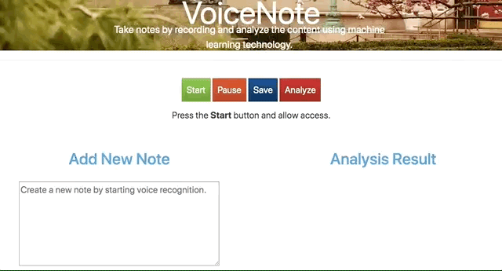
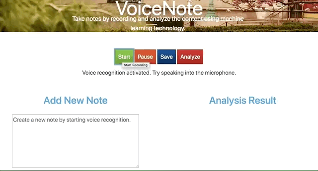
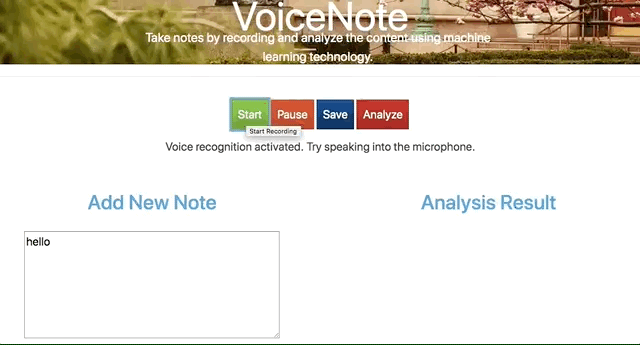
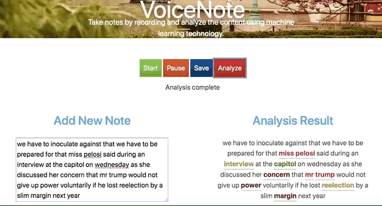
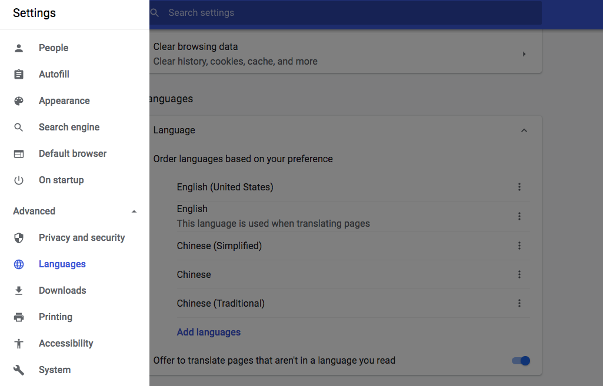

# VoiceNote

**VoiceNote** is a powerful speech-enabled online notepad, designed to empower your ideas by implementing a clean & efficient design, so you can focus on your thoughts. As a web application that combines state-of-the-art speech-recognition technology, text-analysis, documentations saving, and easy registration, together it provides you with the most optimal user experience, and increase your work/study efficiency, to help you with a better life.

## Introduction

For many of us, typing is slow and time-consuming. **VoiceNote** lets you take notes at the speed of speech. The app also lets you move from voice-typing to keyboard-typing seamlessly. In this way, you can record when convenient and type when more appropriate. You can also record and edit your text results right away, and continue recording. No need to go through app modes or even stop dictation.

Other features built for productivity for both type of typing are:  
- Analyze the text for entity identification and category classification.
- Save your voice notes with one-click
- Log-in for history review and research
- Unlimited usage for free

## Development Tools

The web application is built with MEN stack (MongoDB, Express.js, Node.js), Redis, Passport.js, Bootstrap, Web Speech API, MediaRecorder API, Google Natural Language API, Docker, and AWS S3. 

* [S3](https://aws.amazon.com/s3/) - Store raw audio recording files.
* [MongoDB](https://www.mongodb.com/) - NoSQL database.
* [Express.js](https://expressjs.com/) - Web application framework for Node.js. 
* [Node.js](https://nodejs.org/en/) - Open source server environment.
* [Redis](https://redis.io/) - In-memory data structure store to cache analysis results for application speedup.
* [Passport.js](https://expressjs.com/) - Authentication middleware for Node.js.
* [Bootstrap](https://getbootstrap.com/) - Front-end component library.
* [Web Speech API](https://developer.mozilla.org/en-US/docs/Web/API/Web_Speech_API) - For speech recognition and real time transcribe.
* [MediaRecorder API](https://developer.mozilla.org/en-US/docs/Web/API/MediaStream_Recording_API) - Record input voice stream. 
* [Google Natural Language API](https://cloud.google.com/natural-language/) - Derive insights from text using Google machine learning.
* [Docker](https://www.docker.com) - Create, deploy, and run applications by using containers.
* [Jira](https://www.atlassian.com/software/jira) - Project management.

## Usage in local environment 
You can clone the entire folder and run the application using Node.js or Docker. Note that our application depends on several cloud services including MongoDB, AWS, Redis, and Google Cloud API. You can setup the Google API using [this link](https://cloud.google.com/natural-language/docs/quickstart-client-libraries), AWS S3 using [this link](https://aws.amazon.com/s3/), MongoDB on [Mongo Atlas](https://www.mongodb.com/cloud/atlas), and Redis on [Redis Lab](https://redislabs.com).  
Create .env file and put in the following information.
``` 
MONGODB_URI = <Your Mongo Atlas MONGODB_URI>
AWS_ACCESS_KEY = <Your AWS_ACCESS_KEY>
AWS_SECRET_ACCESS_KEY = <Your AWS_SECRET_ACCESS_KEY>
AWS_bucket = <Your AWS S3 bucket name to store audio files>
REDIS_PORT = <Your REDIS_PORT>
REDIS_ENDPOINT = <Your REDIS_ENDPOINT>
REDIS_PASSWORD = <Your REDIS_PASSWORD>
``` 
Build a docker image.
``` 
docker build -t node-web-app .
``` 
Run the application in localhost port 3000.
``` 
docker run -p 3000:3000 node-web-app
```
Or run the app using node.
``` 
npm install 
node app.js 
```

## Demo


## Target Users - who can benefit from VoiceNote?

Even though **VoiceNote** is initially built for students whose hard to come up with the instructor while taking notes. Anyone who is tired of ordinary key-typing might find **VoiceNote** useful. It might also be helpful specifically for people with difficulties in typing. Such difficulties could be of a result of physical condition, or simply not mastering the keyboard typing technique in an early enough age.

In addition, people who type a lot as their profession or hobby might find **VoiceNote** very useful as long keyboard typing might be very tiring, and even have medical implications as side effects. Needless to say, transcribers (from students to professionals) will find **VoiceNote** super helpful, as they can listen to a recording and repeat the speech into the mic, to get **VoiceNote** to transcribe it for them.

## Instructions

**Pre-operation:**  
- Connect a high-quality microphone to your PC (if you have a built-in microphone it might be good enough)
- Open your Chrome Browser(required)

**Operation:**  
**1.** Enter the website


**2.** Click the **Start** Button, start recording your voice

   After clicking the **Start** Button, hints show below “Voice Recognition activate. Try speaking into the microphone”.
   
   
   
   >*Note: For the first time only: Your browser will pop up a request for you to allow the site to listen to your mic. Click "Allow".*

**3.** Start dictating. Speak slowly and clearly. Space your words and emphasize correct diction for better results.

   Once you click the **Start** Button, VoiceNote starts recording your voice for you through your microphone, and display the real-time recognition results in the left dialog box.




**4.** (Another Approach) Text into the left dialog box directly if you want!

   Beyond taking notes through voice recognition, another approach is type into the left dialog box directly, the text result is also displayed in real time.


>*Note: You can text into the dialog box any time, no matter you are in the recording mode or not.*

**5.** Click **Pause** Button

   Click the **Pause** Button to stop the real-time voice recognition.





>*Note: If there is no voice be detected for a while, the voice recognition will stop
automatically.*

**6.** Repeat the step1-4 before you save your note.

   You can either speak or text your note as many times as you want before you save it.

**7.** Click **Analysis** Button

   Click the **Analysis** Button, the analysis result is displayed on the right dialog box.


**8.** Check the Entities Indentifications of the word by placing your cursor on the word.


**9.** Click **Save** Button

   Click **Save** Button to save your voice nots.



>*Note: you need to log in to save your result. The left dialog box will be cleared after saving.*

**10.** Check the **History**

   Click **History** on the upper left corner, to check your history voice notes.


>*Note: you need to log in to review your history.*

**11.**(Side function) **Sign-up/Log-in**

   Click the **Sign In** Button on the upper left corner. If you are the first-time user, please sign-up by setting your username and password; if you are the return user, you can directly log in with your username and password.


>*Note: Sign in is not required to use VoiceNote, but you need to log in to save your notes and review your history.*


## Troubleshooting

Most common causes for failures are:  
1. Hardware problem with the microphone 
2. Browser not Chrome 
3. Permission to listen not granted 
4. Chrome listens to the wrong microphone 

To fix the last 2 problems, you should click on the small camera icon in the browser's address bar (will appear after you click the mic) and there set the permission to Allow **VoiceNote** and pick the correct microphone from the drop-down list.

## Language Supported

**VoiceNote** is developed based on the speech recognition fucntion built-in Chrome Browser and Google Cloud API. Right now, it only supports **English** language. When you do a voice search, please set English as your default language in Chrome. 



Head into the main Google app settings (open the Google Chrome, then select Settings in the flyout menu on the left). From there, open the Language section. The menu item you’re looking for is predictably called Languages. This will open up a new selection menu with dozens of languages, each one with a checkbox. You can order them for your laptop to recognize on the fly, but make sure you set English in the 1st order as the default language.


## Compatibility & System Requirements

**VoiceNote** is really a broad-platform app. As long as you run it through a Chrome browser it will work. No need for installation, disk space or high-end machines. It will run smoothly on your PC, desktop, laptop and Chromebook. You might try it on your tablets and phones, but it might have issues with some devices.

## Future work
Since our Web Speech API only works using localhost or HTTPS. We plan to apply for SSL certification and deloy the application on the web that use HTTPS for every external endpoint.
